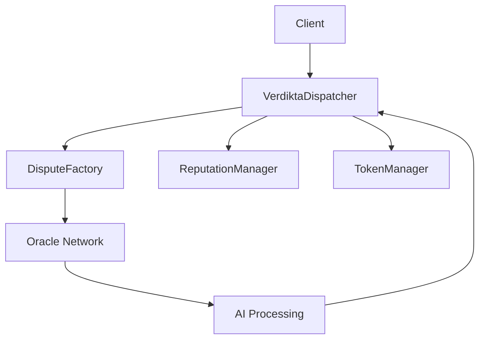

# Smart Contracts Overview

!!! warning "Content in Development"
    This content is being migrated from the source repository. Please check the [Verdikta Dispatcher repository](https://github.com/verdikta/verdikta-dispatcher) for the latest smart contract documentation.

## Overview

Verdikta's smart contract suite provides the on-chain infrastructure for decentralized dispute resolution.

## Core Contracts

### VerdiktaDispatcher
- **Purpose**: Main orchestration contract for dispute management
- **Network**: Base Sepolia (Testnet)
- **Address**: `0x...` (TBD)

### ReputationManager
- **Purpose**: Manages arbiter reputation and scoring
- **Features**: Stake tracking, performance metrics, slashing

### TokenManager
- **Purpose**: Handles VDK token operations
- **Features**: Staking, rewards, fee collection

### DisputeFactory
- **Purpose**: Creates and manages individual dispute instances
- **Features**: Evidence storage, decision recording

## Contract Interactions



## Key Features

### Dispute Lifecycle
1. **Creation**: Submit dispute with evidence and stake
2. **Assignment**: Automatic arbiter selection based on reputation
3. **Processing**: Oracle network triggers AI analysis
4. **Resolution**: Decision recorded on-chain with justification
5. **Execution**: Automatic fund distribution based on outcome

### Economic Model
- **Staking**: Arbiters stake VDK tokens to participate
- **Fees**: Users pay fees in VDK or ETH
- **Rewards**: Arbiters earn fees for accurate decisions
- **Slashing**: Poor performance results in stake reduction

## Network Information

### Base Sepolia Testnet
- **Chain ID**: 84532
- **RPC URL**: https://sepolia.base.org
- **Explorer**: https://sepolia.basescan.org

### Contract Addresses
```typescript
const CONTRACTS = {
  VerdiktaDispatcher: "0x...",
  ReputationManager: "0x...",
  TokenManager: "0x...",
  DisputeFactory: "0x..."
};
```

## Integration Guide

- [Dispatcher Contract](dispatcher.md) - Main contract integration
- [Token Management](token.md) - VDK token operations
- [Oracle Integration](oracle.md) - Working with arbiters
- [Deployment Guide](deployment.md) - Deploying your own instance

## Security Considerations

- All contracts are upgradeable through governance
- Multi-signature wallet controls critical functions
- Time delays on sensitive operations
- Emergency pause functionality available 