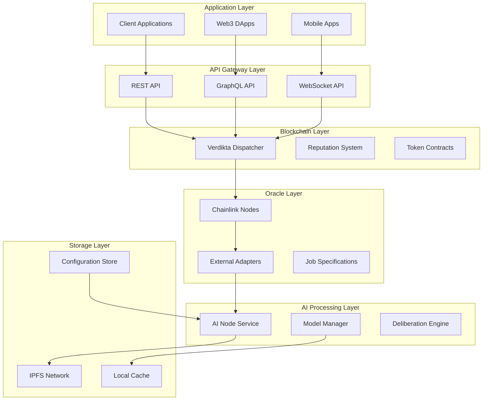
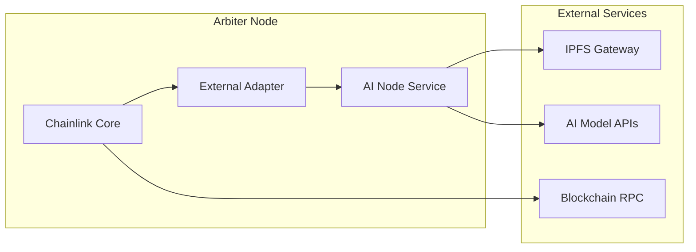
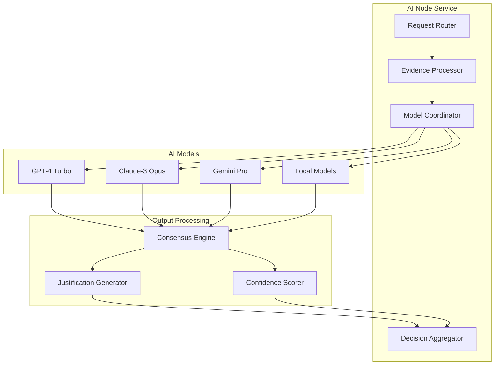
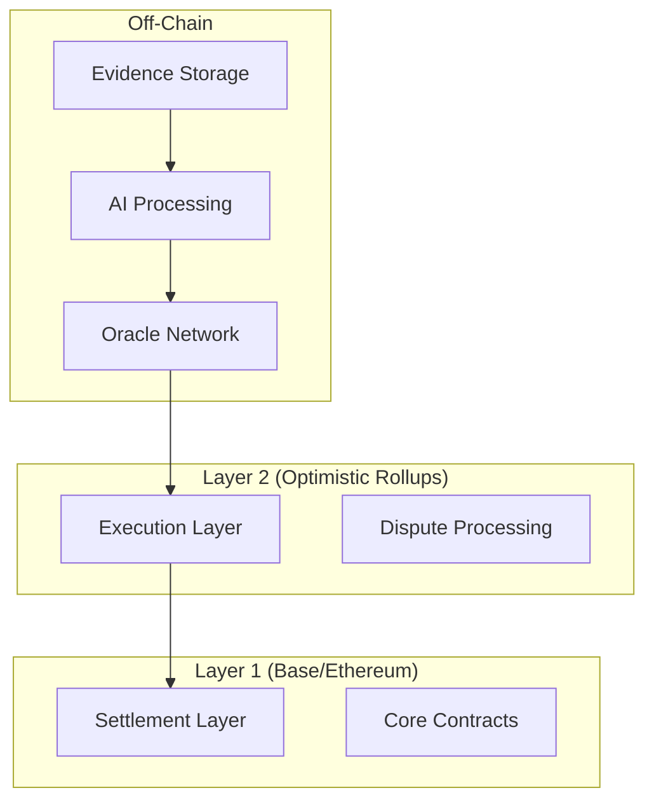

# Technical Architecture

## System Architecture Overview

Verdikta implements a layered architecture that separates concerns and ensures scalability, security, and maintainability.



## Component Details

### 1. Verdikta Dispatcher (Smart Contracts)

The core blockchain component that manages the entire dispute resolution lifecycle.

#### Key Contracts

- **`VerdiktaDispatcher.sol`**: Main orchestration contract
- **`ReputationManager.sol`**: Handles arbiter reputation and scoring
- **`TokenManager.sol`**: Manages staking, rewards, and payments
- **`DisputeFactory.sol`**: Creates and manages individual disputes

#### Dispatcher Functions

```solidity
// Core dispute management
function createDispute(bytes32 evidenceHash, uint256 stake) external
function assignArbiters(uint256 disputeId) external
function submitDecision(uint256 disputeId, Decision decision) external
function executeResolution(uint256 disputeId) external

// Reputation management
function updateArbiterReputation(address arbiter, int256 delta) external
function getArbiterScore(address arbiter) external view returns (uint256)

// Staking and rewards
function stakeTokens(uint256 amount) external
function claimRewards() external
function slash(address arbiter, uint256 amount) external
```

### 2. Arbiter Oracle Network

Chainlink-based oracles enhanced with AI capabilities for dispute processing.

#### Architecture Components



#### Job Specification

```toml
type = "directrequest"
schemaVersion = 1
name = "verdikta-arbitration"
contractAddress = "0x..." # Dispatcher contract
minIncomingConfirmations = 1

observationSource = """
    decode_log   [type="ethabidecodelog"
                  abi="OracleRequest(bytes32 indexed specId, address requester, bytes32 requestId, uint256 payment, address callbackAddr, bytes4 callbackFunctionId, uint256 cancelExpiration, uint256 dataVersion, bytes data)"
                  data="$(jobRun.logData)"
                  topics="$(jobRun.logTopics)"]

    decode_cbor  [type="cborparse" data="$(decode_log.data)"]

    fetch_ipfs   [type="bridge" name="verdikta-adapter" 
                  requestData="{\\"id\\": $(jobSpec.externalJobID), \\"data\\": { \\"ipfsHash\\": $(decode_cbor.ipfsHash), \\"disputeId\\": $(decode_cbor.disputeId) }}"]

    parse        [type="jsonparse" path="data,decision"]

    encode_data  [type="ethabiencode"
                  abi="(uint256 disputeId, uint8 decision, string justification)"
                  data="{ \\"disputeId\\": $(decode_cbor.disputeId), \\"decision\\": $(parse), \\"justification\\": $(fetch_ipfs.justification) }"]

    encode_tx    [type="ethabiencode"
                  abi="fulfillOracleRequest(bytes32 requestId, bytes32 data)"
                  data="{\\"requestId\\": $(decode_log.requestId), \\"data\\": $(encode_data)}"]

    submit_tx    [type="ethtx" to="$(decode_log.callbackAddr)" data="$(encode_tx)"]

    decode_log -> decode_cbor -> fetch_ipfs -> parse -> encode_data -> encode_tx -> submit_tx
"""
```

### 3. AI Processing Engine

The core AI component that analyzes disputes and generates decisions.

#### Multi-Model Architecture



#### Model Weighting Algorithm

```typescript
interface ModelResponse {
  decision: 'plaintiff' | 'defendant' | 'split';
  confidence: number;
  reasoning: string;
  modelId: string;
}

interface ModelWeight {
  modelId: string;
  baseWeight: number;
  specialtyWeight: number;
  reputationScore: number;
}

function calculateFinalDecision(
  responses: ModelResponse[],
  weights: ModelWeight[]
): Decision {
  const weightedVotes = responses.map(response => {
    const weight = weights.find(w => w.modelId === response.modelId);
    const totalWeight = weight.baseWeight * weight.specialtyWeight * weight.reputationScore;
    
    return {
      ...response,
      weight: totalWeight * response.confidence
    };
  });
  
  // Aggregate weighted votes
  const votes = {
    plaintiff: 0,
    defendant: 0,
    split: 0
  };
  
  weightedVotes.forEach(vote => {
    votes[vote.decision] += vote.weight;
  });
  
  // Return decision with highest weighted score
  const winner = Object.keys(votes).reduce((a, b) => 
    votes[a] > votes[b] ? a : b
  );
  
  return {
    decision: winner,
    confidence: Math.max(...Object.values(votes)) / Object.values(votes).reduce((a, b) => a + b),
    justification: generateJustification(weightedVotes, winner)
  };
}
```

### 4. Data Flow

#### Dispute Processing Pipeline

1. **Initiation**
   ```
   Client → Smart Contract → Event Emission
   ```

2. **Oracle Activation**
   ```
   Chainlink Node → Job Spec → External Adapter
   ```

3. **Evidence Retrieval**
   ```
   External Adapter → IPFS → Evidence Package
   ```

4. **AI Processing**
   ```
   AI Node → Multiple Models → Consensus Decision
   ```

5. **Result Submission**
   ```
   External Adapter → Chainlink Node → Smart Contract
   ```

6. **Resolution Execution**
   ```
   Smart Contract → Automatic Execution → State Update
   ```

## Security Architecture

### Access Control

```solidity
// Role-based access control
contract AccessControl {
    bytes32 public constant ADMIN_ROLE = keccak256("ADMIN_ROLE");
    bytes32 public constant ARBITER_ROLE = keccak256("ARBITER_ROLE");
    bytes32 public constant ORACLE_ROLE = keccak256("ORACLE_ROLE");
    
    modifier onlyRole(bytes32 role) {
        require(hasRole(role, msg.sender), "AccessControl: unauthorized");
        _;
    }
    
    function grantRole(bytes32 role, address account) external onlyRole(ADMIN_ROLE);
    function revokeRole(bytes32 role, address account) external onlyRole(ADMIN_ROLE);
}
```

### Multi-Signature Validation

```solidity
struct Decision {
    uint8 outcome;
    string justification;
    bytes[] signatures;
    address[] signers;
}

function validateDecision(Decision memory decision) internal view returns (bool) {
    require(decision.signatures.length >= MIN_SIGNATURES, "Insufficient signatures");
    
    bytes32 hash = keccak256(abi.encodePacked(decision.outcome, decision.justification));
    
    for (uint i = 0; i < decision.signatures.length; i++) {
        address recovered = recoverSigner(hash, decision.signatures[i]);
        require(hasRole(ARBITER_ROLE, recovered), "Invalid signer");
        require(recovered == decision.signers[i], "Signature mismatch");
    }
    
    return true;
}
```

### Economic Security

- **Staking Requirements**: Arbiters must stake tokens to participate
- **Slashing Conditions**: Malicious behavior results in stake reduction
- **Reputation System**: Poor decisions reduce future assignment probability
- **Insurance Pool**: Community fund covers edge cases and appeals

## Scalability Solutions

### Layer 2 Integration



### Performance Optimization

- **Parallel Processing**: Multiple disputes processed simultaneously
- **Caching Layer**: Frequently accessed data cached locally
- **Load Balancing**: Requests distributed across multiple AI nodes
- **Batch Operations**: Multiple operations bundled for efficiency

## Monitoring & Observability

### Key Metrics

- **Dispute Resolution Time**: Average time from submission to resolution
- **Oracle Response Time**: Time for oracles to process requests
- **AI Model Performance**: Accuracy and confidence scores
- **Network Utilization**: Resource usage across components
- **Economic Metrics**: Fees, rewards, and stake utilization

### Health Checks

```typescript
interface HealthCheck {
  component: string;
  status: 'healthy' | 'degraded' | 'unhealthy';
  lastChecked: Date;
  metrics: Record<string, number>;
}

const healthChecks = {
  blockchain: checkBlockchainHealth,
  oracles: checkOracleHealth,
  aiService: checkAIServiceHealth,
  ipfs: checkIPFSHealth
};
```

This technical architecture ensures Verdikta can scale to handle thousands of disputes while maintaining security, decentralization, and reliability. 