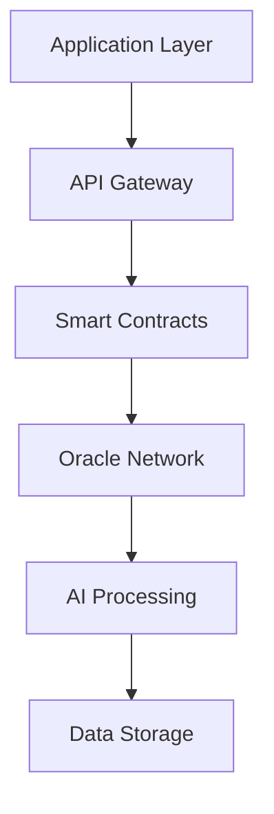

# Verdikta Whitepaper

## Abstract

Verdikta introduces a novel approach to dispute resolution by combining decentralized blockchain infrastructure with advanced artificial intelligence. Our system addresses the fundamental challenges of traditional arbitration: high costs, long resolution times, and potential bias. By leveraging multiple AI models in a consensus mechanism, Verdikta provides fast, cost-effective, and impartial dispute resolution services.

## Table of Contents

- [Introduction](#introduction)
- [Problem Statement](#problem-statement)
- [Solution Overview](#solution-overview)
- [Technical Architecture](#technical-architecture)
- [Economic Model](#economic-model)
- [Governance](#governance)
- [Roadmap](#roadmap)
- [Conclusion](#conclusion)

## Introduction

The digital economy has created unprecedented opportunities for global commerce, but traditional dispute resolution mechanisms have failed to adapt. Current arbitration systems are expensive, slow, and often biased toward established parties. Verdikta addresses these limitations through a decentralized, AI-powered arbitration network built on blockchain technology.

## Problem Statement

### Traditional Arbitration Challenges

1. **High Costs**: Traditional arbitration can cost thousands of dollars per case
2. **Long Delays**: Resolution times often extend from months to years
3. **Limited Access**: Small disputes are economically unviable to pursue
4. **Human Bias**: Arbitrators may have unconscious or conscious biases
5. **Lack of Transparency**: Decisions often lack detailed justification
6. **Geographic Limitations**: Cross-border disputes face jurisdictional issues

### Digital Economy Needs

- **Micro-transactions**: Small value disputes need proportional resolution costs
- **Global Scale**: International commerce requires universally accessible systems
- **Real-time Decisions**: Digital marketplaces need fast resolution
- **Consistency**: Similar cases should have similar outcomes
- **Transparency**: All parties should understand the decision process

## Solution Overview

### Core Innovation

Verdikta combines three key technologies:

1. **Blockchain Infrastructure**: Provides transparency, immutability, and global access
2. **AI Consensus**: Multiple AI models deliberate to reduce bias and improve accuracy
3. **Economic Incentives**: Token-based system aligns all participants toward fair outcomes

### Key Benefits

- **Speed**: Decisions in minutes instead of months
- **Cost**: Fraction of traditional arbitration fees
- **Fairness**: AI reduces human bias and emotional decisions
- **Accessibility**: Available 24/7 worldwide
- **Transparency**: All decisions recorded on-chain with full justification
- **Scalability**: Can handle millions of disputes simultaneously

## Technical Architecture

### Multi-Layer Design

### Consensus Mechanism

Verdikta employs a novel "AI Jury" system where multiple independent AI models analyze each dispute:

1. **Evidence Processing**: All evidence is standardized and prepared for analysis
2. **Multi-Model Analysis**: 3-7 different AI models independently evaluate the case
3. **Weighted Voting**: Models' decisions are weighted based on their historical accuracy
4. **Consensus Building**: Final decision requires supermajority consensus
5. **Justification Generation**: Detailed reasoning is provided for transparency

### Security Features

- **Cryptographic Evidence**: All evidence is cryptographically verified
- **Multi-Signature Validation**: Decisions require multiple arbiter signatures
- **Stake-Based Participation**: Arbiters must stake tokens to participate
- **Reputation System**: Poor decisions reduce future earning potential
- **Appeal Mechanism**: Disputed decisions can be escalated

## Economic Model

### Token Utility

The Verdikta Token (VDK) serves multiple functions:

1. **Payment**: Users pay fees in VDK tokens
2. **Staking**: Arbiters stake VDK to participate in the network
3. **Rewards**: Successful arbiters earn VDK rewards
4. **Governance**: Token holders vote on protocol parameters

### Fee Structure

| Dispute Value | Fee Rate | Minimum Fee |
|---------------|----------|-------------|
| $0 - $100 | 5% | $1 |
| $100 - $1,000 | 3% | $5 |
| $1,000 - $10,000 | 2% | $30 |
| $10,000+ | 1% | $200 |

### Incentive Alignment

- **Arbiters**: Earn fees for accurate decisions, lose stake for poor ones
- **Users**: Pay lower fees than traditional systems
- **Developers**: Earn revenue sharing for building applications
- **Token Holders**: Benefit from network growth and fee collection

## Governance

### Decentralized Autonomous Organization (DAO)

Verdikta will transition to full DAO governance over time:

#### Phase 1: Foundation Governance (Current)
- Core team manages protocol parameters
- Community feedback through forums and proposals
- Regular governance calls and transparency reports

#### Phase 2: Hybrid Governance (Q2 2024)
- Token holders vote on major decisions
- Foundation retains technical upgrade authority
- Delegation system for specialized committees

#### Phase 3: Full DAO (Q4 2024)
- Complete decentralization of governance
- On-chain voting for all parameters
- Community-elected council system

### Governance Parameters

Token holders will vote on:
- Fee rates and structures
- AI model selection and weighting
- Dispute categories and rules
- Treasury fund allocation
- Protocol upgrades

## Roadmap

### 2024 Q1: Beta Launch ✅
- [x] Base Sepolia testnet deployment
- [x] Initial arbiter node network
- [x] Basic dispute resolution functionality
- [x] Community testing program

### 2024 Q2: Enhanced Features
- [ ] Multi-chain deployment (Ethereum, Polygon)
- [ ] Advanced AI model integration
- [ ] Mobile SDK release
- [ ] Partnership integrations

### 2024 Q3: Mainnet Launch
- [ ] Production deployment on Base Mainnet
- [ ] Token generation event
- [ ] Liquidity provision
- [ ] Marketing campaign

### 2024 Q4: Ecosystem Growth
- [ ] Layer 2 scaling solutions
- [ ] International expansion
- [ ] Enterprise partnerships
- [ ] Full DAO transition

### 2025: Advanced Features
- [ ] Cross-chain arbitration
- [ ] Specialized dispute types
- [ ] AI model marketplace
- [ ] Regulatory compliance tools

## Research & Development

### Ongoing Research Areas

1. **AI Bias Mitigation**: Developing techniques to reduce algorithmic bias
2. **Scalability Solutions**: Layer 2 and off-chain processing optimization
3. **Privacy Preservation**: Zero-knowledge proof integration
4. **Interoperability**: Cross-chain dispute resolution protocols
5. **Regulatory Compliance**: Working with legal experts on jurisdiction issues

### Academic Partnerships

- University of California, Berkeley - AI Ethics Research
- MIT - Blockchain Scalability Studies
- Stanford - Legal Technology Applications
- Harvard Law School - Digital Arbitration Framework

## Risk Analysis

### Technical Risks

- **AI Model Failures**: Mitigation through diverse model portfolio
- **Smart Contract Bugs**: Extensive testing and formal verification
- **Oracle Reliability**: Multiple oracle providers and redundancy
- **Scalability Limits**: Layer 2 solutions and optimization

### Economic Risks

- **Token Volatility**: Treasury diversification and stability mechanisms
- **Attack Vectors**: Economic security through staking requirements
- **Market Adoption**: Strong value proposition and user incentives

### Regulatory Risks

- **Legal Uncertainty**: Proactive engagement with regulators
- **Jurisdictional Issues**: Focus on international standards
- **Compliance Requirements**: Built-in compliance tools

## Conclusion

Verdikta represents a paradigm shift in dispute resolution, leveraging the best of blockchain technology and artificial intelligence to create a fairer, faster, and more accessible system. Our approach addresses fundamental limitations of traditional arbitration while providing new opportunities for global commerce.

The combination of economic incentives, technical innovation, and community governance creates a sustainable ecosystem that benefits all participants. As we progress through our roadmap, Verdikta will become the standard for digital dispute resolution, enabling a more efficient and equitable global economy.

---

!!! info "Living Document"
    This whitepaper is a living document that will be updated as the Verdikta protocol evolves. The latest version can always be found at [docs.verdikta.org](https://docs.verdikta.org).

!!! warning "Forward-Looking Statements"
    This document contains forward-looking statements that involve risks and uncertainties. Actual results may differ materially from those projected. Please read our full risk disclosures before participating in the Verdikta ecosystem. 